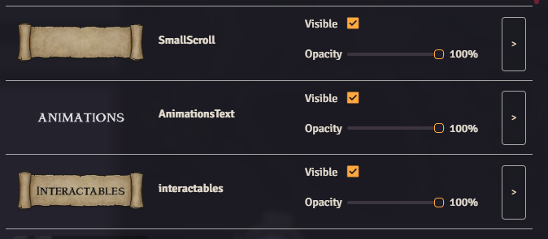

### Tile Visibility Browser
Foundry macro that creates a small UI displaying all tiles on the current scene.
Gives inputs to toggle visibility, and opacity, and adds a button to select and move your screen to the tile.

